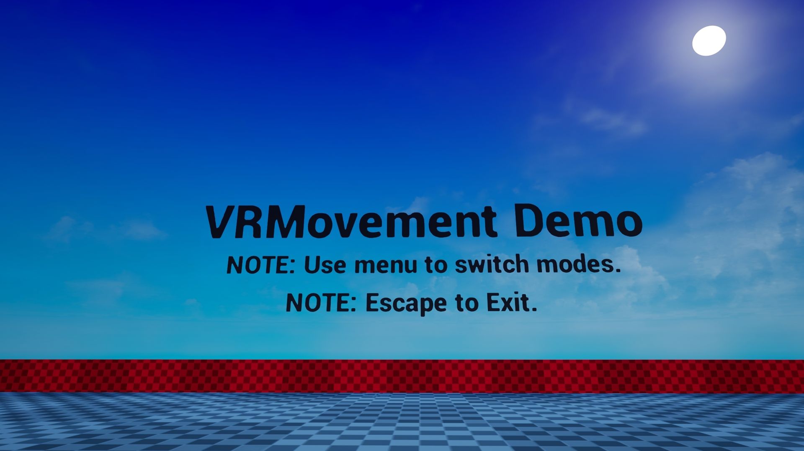

# VRMovement Demo

This is a seperated movement project for virtual reality within Unreal Engine 4.23.

The project was seperated to show the use of many different movement modes within Unreal Engine 4 originally using the HTC Vive but now 
also has support for the Valve Index headset and controllers also.

Supported Movement Modes:

- Developer
- Teleport
- Speed Ramp
- Joystick
- Lean
- Swinging Arms

Direction Modes:

- Controller 
- HMD

How it works:

The way the project works is by having two hand classes that are spawned by the pawn class which can update functions in 
the VRMovement class. There is also a developer mode mentioned above that allows the user to test VR Functionality using 
the mouse and keyboard. The way this is done is to play the game in editor, not using the VR Preview but the default play option.

The rest of the movement options reside in the BP_VRMovement asset where things like speed, vignette and other things can be 
disabled or adjusted to the users liking. I have also setup a default level to change movement modes during runtime. Find a build
 of the level at the given link:

https://drive.google.com/file/d/1bVnxGjDB4Y3HCIhO22-ejgEKIFwYw6zW/view?usp=sharing

----------------------------------------------------------------------------------

